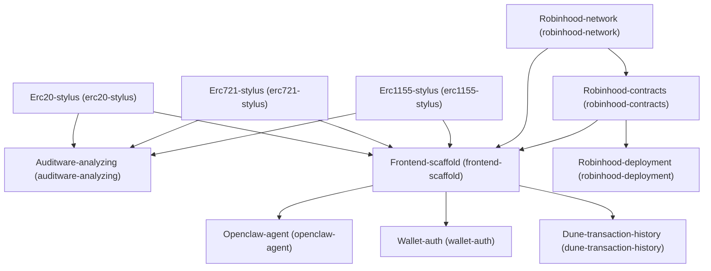

# Architecture

## Dependency Graph

## Execution / Implementation Order

1. **Erc20-stylus** (`4accaf4a`)
2. **Erc721-stylus** (`15f54cfe`)
3. **Erc1155-stylus** (`9e7924e0`)
4. **Robinhood-network** (`34140e81`)
5. **Auditware-analyzing** (`0893ddc4`)
6. **Robinhood-contracts** (`f3d0d92d`)
7. **Frontend-scaffold** (`f41c86f5`)
8. **Robinhood-deployment** (`f3399a44`)
9. **Openclaw-agent** (`f5b1a79a`)
10. **Wallet-auth** (`7fc516d0`)
11. **Dune-transaction-history** (`d81dacd9`)
